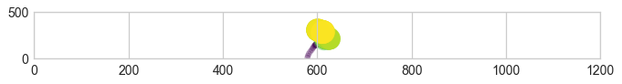
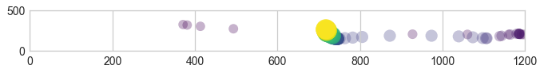
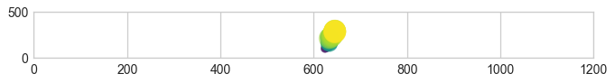
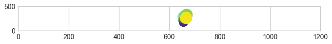
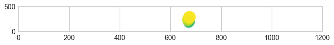
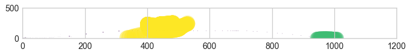
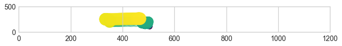
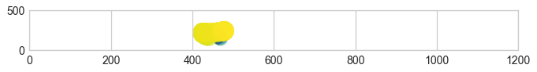
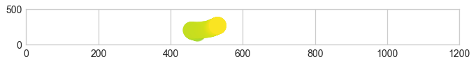
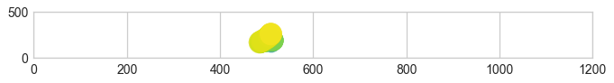

```python
from os import listdir
from os.path import isfile, join
import ast
import json
import re
import pandas as pd
import matplotlib.pyplot as plt
import numpy as np
from mpl_toolkits.mplot3d import Axes3D

%matplotlib inline
```


```python
mypath = '/Users/admin/Downloads/entries/data/'
onlyfiles = [f for f in listdir(mypath) if isfile(join(mypath, f))]
onlyfiles.remove('common_unames.txt')
```


```python
def separateFields(entry:str)->list:
    "Separates the entry into 6 fields"
    entry = entry.split(', "')
    res = entry[0:5]
    res.append(''.join(entry[5:-1]))
    res.append(entry[-1])
    return res

def getFields(entry:str)->dict:
    """Returns username, passHash, usernameFieldLogs and Headers from the entry"""
    entry = separateFields(entry)
    return { 
        "user": entry[0].split(':')[-1].strip().replace('"', ''),
        "pass": int(entry[1].split(':')[-1]),
        "usernameFieldLogs": ast.literal_eval(entry[2].split(':')[-1].strip()),
        "passwordFieldLogs": ast.literal_eval(entry[3].split(':')[-1].strip()),
        "mouseMovements": ast.literal_eval(entry[4].split(':')[-1].strip()),
        "headers": parseHTTPHeaders(entry[5].split('":')[-1].strip()),
        "time": int(entry[6].split(":")[-1].replace('}', '').strip())
        }

def parseHTTPHeaders(header_str:str)->dict:
    header_str =  re.findall(r'\("[^)]*"\)', header_str)
    header_str = [[_.replace('"', '') for _ in re.findall(r'(?=("[^"]+)")', each)[0:2]] for each in header_str]
    return dict(header_str)
```


```python
def getUserData(user : int) -> [dict]:
    with open(mypath+onlyfiles[user], 'r') as f:
        content = f.read().replace("\'", '"').replace('}{', '}#{').split('#')
        return [getFields(_) for _ in content]
```


```python
def plotUserMouse3D(mouseMovement):
    fig=plt.figure(figsize=(18, 16), dpi= 80, facecolor='w', edgecolor='k')
    ax = plt.subplot(2,2,1, projection='3d')
    #ax.scatter3D(user1_mouseMovement[0], user1_mouseMovement[1], user1_mouseMovement[2], c=user1_mouseMovement[2], cmap='Greens');
    ax.plot3D(mouseMovement[0], mouseMovement[1], mouseMovement[2])

```


```python
def plotUserMouseScatter(mouseMovements, figno):
    color = mouseMovements[2]/max(mouseMovements[2])
    fig = plt.figure(figsize=(10,10), dpi=80)
    plt.subplot(*figno)
    plt.ylim([0,500])
    plt.xlim([0,1200])
    plt.scatter(mouseMovements[0], mouseMovements[1], c=color, s=color*500, alpha=0.3)

    
def plotUserMouseScatterMultiple(user, n=5):
    for i in range(n):
        plotUserMouseScatter(pd.DataFrame(user[i]['mouseMovements']), (10,1,i+1))

```

## Plotting user behavior

When we try to draw a picture of the user behavior, we can clearly see a unique pattern to two users.


```python
# Plot user 1
user1 = getUserData(1)
plotUserMouseScatterMultiple(user1, n=6)
```

















```python
# Plot user 2
user2 = getUserData(2)
plotUserMouseScatterMultiple(user2, n=6)
```

















## Time for some Machine Learning

'After some failed attempts at one-shot learning using deep NNs'


```python
def pad(arr, n):
    """
    If arr is not equal to n in length, fill it with zero
    
    >>>pad([1, 1], 5)
    [1, 1, 1, 1, 1]
    """
    assert n >= len(arr)
    return arr + (n-len(arr)) * [[0, 0, 0]]

# Read all the files backed up from the server

data = []
for i in range(len(onlyfiles)):
    data.append(getUserData(i))

```


```python
# Filter all files that have at least 20 login attempts
data = list(filter(lambda x: len(x) >= 20, data))
```


```python
# Wrangle and extract the mouse movements

data = [[pad(each['mouseMovements'],n=500), user] for user in range(len(data))
    for each in data[user]]
```


```python
# Separate training cases and class labels
dataX = []
dataY = []

for each in data:
    dataX.append(each[0])
    dataY.append(each[1])

```


```python
# numpy is much better for remainder of the steps than python lists
dataX = np.array(dataX)
dataX = dataX.reshape(161, 1500)
dataY = np.array(dataY)
dataY = dataY.reshape(len(dataY),1)
```

### Multiple ML algorithm results


```python
import sklearn as sk
from sklearn import svm
from sklearn import tree
from sklearn.model_selection import train_test_split

# training set = 63% and testing set = 33%
X_train, X_test, y_train, y_test = train_test_split(
    dataX, dataY, test_size=0.33, random_state=30)

```

### SUPPORT VECTOR MACHINES


```python
SVM = svm.LinearSVC()
SVM = SVM.fit(X_train, y_train)
print(f"Simple SVM: {SVM.score(X_test, y_test)}")
```

    Simple SVM: 0.3148148148148148


    /anaconda3/lib/python3.6/site-packages/sklearn/utils/validation.py:761: DataConversionWarning: A column-vector y was passed when a 1d array was expected. Please change the shape of y to (n_samples, ), for example using ravel().
      y = column_or_1d(y, warn=True)
    /anaconda3/lib/python3.6/site-packages/sklearn/svm/base.py:931: ConvergenceWarning: Liblinear failed to converge, increase the number of iterations.
      "the number of iterations.", ConvergenceWarning)


```python
# One versus one is actually giving very poor performance. Why?
# Probably the classes themselves are not very different o vs o
clf = svm.SVC(gamma='auto', decision_function_shape='ovo')
clf = clf.fit(X_train, y_train)
clf.score(X_test, y_test)
```

    /anaconda3/lib/python3.6/site-packages/sklearn/utils/validation.py:761: DataConversionWarning: A column-vector y was passed when a 1d array was expected. Please change the shape of y to (n_samples, ), for example using ravel().
      y = column_or_1d(y, warn=True)


    0.1111111111111111


Some engineering with SVM actually gives a very good performance.


```python
# Implement binary discriminator
for each in range(len(np.unique(y_train))):
    _SVM = svm.LinearSVC()
    _y_train = y_train.copy()
    _y_test = y_test.copy()
    _SVM.fit(X_train, np.where(_y_train != each, -1, each))
    print(f"Score for User {each}:{_SVM.score(X_test, np.where(_y_test != each, -1, each))}")
```

    Score for User 0:0.7777777777777778
    Score for User 1:0.7777777777777778
    Score for User 2:0.7037037037037037
    Score for User 3:0.7592592592592593
    Score for User 4:0.6851851851851852
    Score for User 5:0.8148148148148148
    Score for User 6:0.8518518518518519


    /anaconda3/lib/python3.6/site-packages/sklearn/utils/validation.py:761: DataConversionWarning: A column-vector y was passed when a 1d array was expected. Please change the shape of y to (n_samples, ), for example using ravel().
      y = column_or_1d(y, warn=True)
    /anaconda3/lib/python3.6/site-packages/sklearn/svm/base.py:931: ConvergenceWarning: Liblinear failed to converge, increase the number of iterations.
      "the number of iterations.", ConvergenceWarning)
    /anaconda3/lib/python3.6/site-packages/sklearn/utils/validation.py:761: DataConversionWarning: A column-vector y was passed when a 1d array was expected. Please change the shape of y to (n_samples, ), for example using ravel().
      y = column_or_1d(y, warn=True)
    /anaconda3/lib/python3.6/site-packages/sklearn/svm/base.py:931: ConvergenceWarning: Liblinear failed to converge, increase the number of iterations.
      "the number of iterations.", ConvergenceWarning)
    /anaconda3/lib/python3.6/site-packages/sklearn/utils/validation.py:761: DataConversionWarning: A column-vector y was passed when a 1d array was expected. Please change the shape of y to (n_samples, ), for example using ravel().
      y = column_or_1d(y, warn=True)
    /anaconda3/lib/python3.6/site-packages/sklearn/svm/base.py:931: ConvergenceWarning: Liblinear failed to converge, increase the number of iterations.
      "the number of iterations.", ConvergenceWarning)
    /anaconda3/lib/python3.6/site-packages/sklearn/utils/validation.py:761: DataConversionWarning: A column-vector y was passed when a 1d array was expected. Please change the shape of y to (n_samples, ), for example using ravel().
      y = column_or_1d(y, warn=True)
    /anaconda3/lib/python3.6/site-packages/sklearn/svm/base.py:931: ConvergenceWarning: Liblinear failed to converge, increase the number of iterations.
      "the number of iterations.", ConvergenceWarning)
    /anaconda3/lib/python3.6/site-packages/sklearn/utils/validation.py:761: DataConversionWarning: A column-vector y was passed when a 1d array was expected. Please change the shape of y to (n_samples, ), for example using ravel().
      y = column_or_1d(y, warn=True)
    /anaconda3/lib/python3.6/site-packages/sklearn/svm/base.py:931: ConvergenceWarning: Liblinear failed to converge, increase the number of iterations.
      "the number of iterations.", ConvergenceWarning)
    /anaconda3/lib/python3.6/site-packages/sklearn/utils/validation.py:761: DataConversionWarning: A column-vector y was passed when a 1d array was expected. Please change the shape of y to (n_samples, ), for example using ravel().
      y = column_or_1d(y, warn=True)
    /anaconda3/lib/python3.6/site-packages/sklearn/svm/base.py:931: ConvergenceWarning: Liblinear failed to converge, increase the number of iterations.
      "the number of iterations.", ConvergenceWarning)
    /anaconda3/lib/python3.6/site-packages/sklearn/utils/validation.py:761: DataConversionWarning: A column-vector y was passed when a 1d array was expected. Please change the shape of y to (n_samples, ), for example using ravel().
      y = column_or_1d(y, warn=True)
    /anaconda3/lib/python3.6/site-packages/sklearn/svm/base.py:931: ConvergenceWarning: Liblinear failed to converge, increase the number of iterations.
      "the number of iterations.", ConvergenceWarning)


## DECISION TREES
Performance above 0.5 without any feature engineering is actually great. Random guessing would give only 0.15


```python
decision_tree = tree.DecisionTreeClassifier()
decision_tree = decision_tree.fit(X_train, y_train)
decision_tree.score(X_test, y_test)
```


    0.5740740740740741


## RANDOM FOREST
An ensemble random forest (without any feature engineering) is improving upon the decision tree results- a good sign that things can be improved.


```python
from sklearn.ensemble import RandomForestClassifier
rf = RandomForestClassifier(n_estimators=40)
rf.fit(X_train, y_train)
rf.score(X_test, y_test)
```

    /anaconda3/lib/python3.6/site-packages/ipykernel_launcher.py:4: DataConversionWarning: A column-vector y was passed when a 1d array was expected. Please change the shape of y to (n_samples,), for example using ravel().
      after removing the cwd from sys.path.


    0.6666666666666666


### GRADIENT BOOS CLASSIFIER 
good for hypothesis testing :)


```python
from sklearn.ensemble import GradientBoostingClassifier
gbc = GradientBoostingClassifier(n_estimators=40,
                                learning_rate=1.0)
gbc.fit(X_train, y_train)
gbc.score(X_test, y_test)
```

    /anaconda3/lib/python3.6/site-packages/sklearn/utils/validation.py:761: DataConversionWarning: A column-vector y was passed when a 1d array was expected. Please change the shape of y to (n_samples, ), for example using ravel().
      y = column_or_1d(y, warn=True)


    0.5555555555555556


